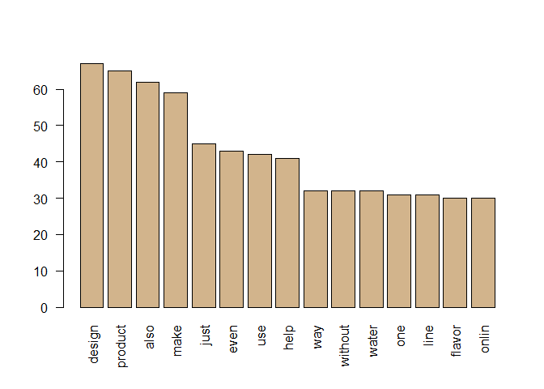
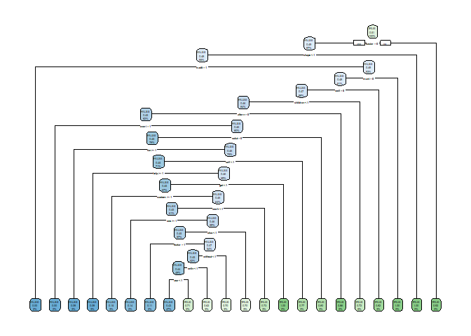
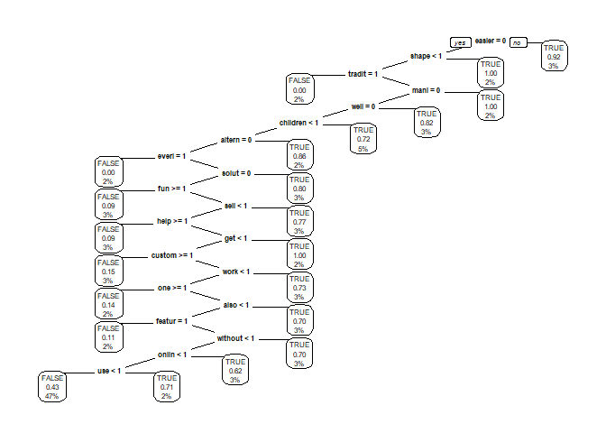
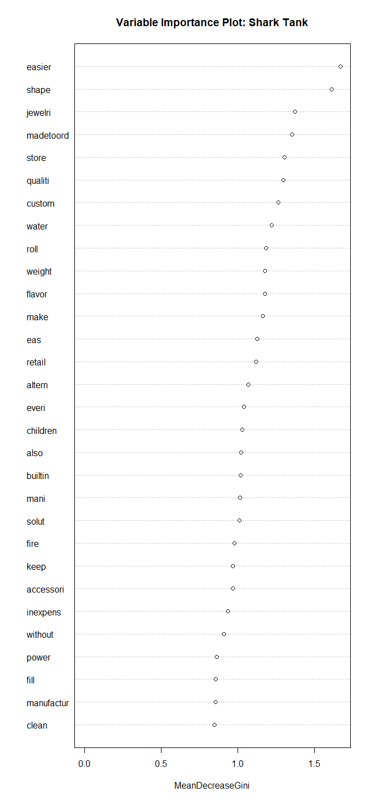
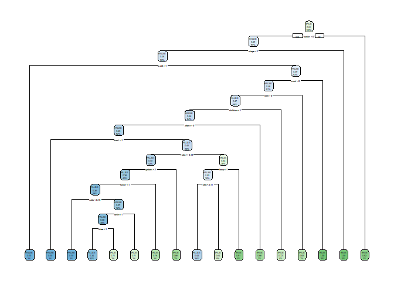
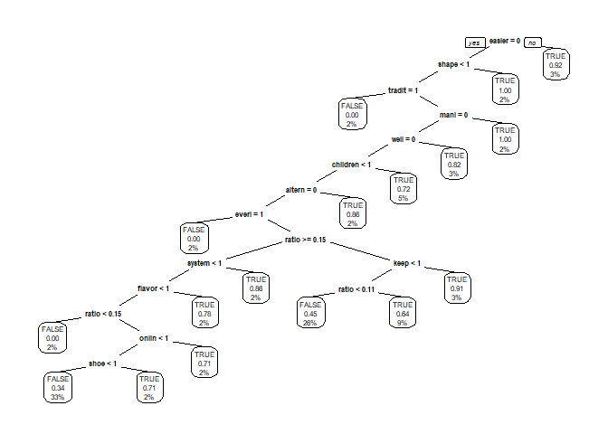
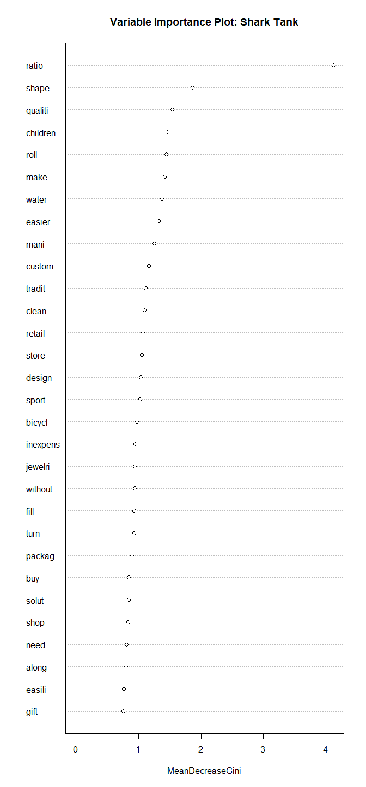

Business Intelligence Using Text Mining
================
Abhay Kulkarni
11/18/2019


# Introduction

## What is Shark Tank?

Shark Tank is an American business reality television series on ABC that
premiered on August 9, 2009.\[1\] The show is the American franchise of
the international format Dragons’ Den, which originated in Japan as
Tigers of Money in 2001. It shows entrepreneurs making business
presentations to a panel of five investors or “sharks,” who decide
whether to invest in their company.

# Project Objective

## Step 1

  - A dataset of Shark Tank episodes is made available. It contains 495
    entrepreneurs making their pitch to the VC sharks. You will ONLY use
    the “Description” column for the initial Text Mining exercise.

  - Extract the text into text corpus and perform the following
    operations:

  - Create Document Text Matrix

  - Use “Deal” as a Dependent Variable

  - Use the CART model and arrive at your CART diagram

  - Build a Logistic Regression Model and find out your accuracy of the
    model

  - Build the RandomForest model and arrive at your varImpPlot

## Step 2

  - Now, add a variable to your analysis called “ratio”. This variable
    is “askedfor/valuation”. (This variable is to be added as a column
    to your dataframe in Step 1)

  - Rebuild “New” models- CART, RandomForest and Logistic Regression

## Step 3

  - CART Tree (Before and After)

  - RandomForest plot (Before and After)

  - Confusion Matrix of Logistic Regression (Before and After)

# Libraries/ Packages

``` r
library(tm)
library(SnowballC)
library(randomForest)
library(RColorBrewer)
library(wordcloud)
library(caret)
library(rpart)
library(rpart.plot)
library(caTools)
library(latexpdf)
```

# Speeding Processor Cores

``` r
library(parallel)
library(doParallel)
```

    ## Warning: package 'doParallel' was built under R version 4.0.2

    ## Loading required package: foreach

    ## Warning: package 'foreach' was built under R version 4.0.2

    ## Loading required package: iterators

    ## Warning: package 'iterators' was built under R version 4.0.2

``` r
clusterforspeed <- makeCluster(detectCores() - 1) ## convention to leave 1 core for OS
registerDoParallel(clusterforspeed)
```

``` r
setwd("H:\\Github PROJECTS\\Text-Mining_SharkTank\\Text-Mining_SharkTank")
getwd()
```

    ## [1] "H:/Github PROJECTS/Text-Mining_SharkTank/Text-Mining_SharkTank"

# Import Dataset and Representation along with data cleaning

## Import Dataset

``` r
SharkTankData = read.csv("Dataset.csv", stringsAsFactors=FALSE)
```

## Data Cleaning

1.  Transform to lower

2.  Remove Numbers

3.  Remove Punctuation

4.  Remove Stopwords

5.  Stem Document

6.  Strip Whitespace

<!-- end list -->

``` r
corpus = Corpus(VectorSource(SharkTankData$description))
corpus = tm_map(corpus, content_transformer(tolower))
corpus = tm_map(corpus, removeNumbers)
corpus = tm_map(corpus, removePunctuation)
corpus = tm_map(corpus, removeWords, c("the", "and", "is" , "in", "for", "where", "when","make","made","like","use","can","compani","company", stopwords("english")))
corpus = tm_map(corpus, stemDocument)
corpus = tm_map(corpus, stripWhitespace)
```

## Word Cloud

``` r
palette =  brewer.pal(8, "Dark2")
wordcloud(corpus,colors=palette, min.freq = 1, max.words = Inf,rot.per=0.35, random.order = FALSE)
```

<!-- -->

## Build a Document-Term Matrix (DTM)

``` r
DTM <- DocumentTermMatrix(corpus)
DTM
```

    ## <<DocumentTermMatrix (documents: 495, terms: 3462)>>
    ## Non-/sparse entries: 9210/1704480
    ## Sparsity           : 99%
    ## Maximal term length: 21
    ## Weighting          : term frequency (tf)

## To reduce the dimensions in DTM, removeSparseTerms and sparsity less than 0.995

``` r
sparse = removeSparseTerms(DTM, 0.995)
```

``` r
sparse
```

    ## <<DocumentTermMatrix (documents: 495, terms: 895)>>
    ## Non-/sparse entries: 6129/436896
    ## Sparsity           : 99%
    ## Maximal term length: 21
    ## Weighting          : term frequency (tf)

## Let’s visualize DocumentTermMatrix

``` r
TDMplot <- as.matrix(sparse)
TDFrequency <- colSums(TDMplot)
TFrequencyPlot<- sort(TDFrequency,decreasing = TRUE)
barplotTDM <- barplot(TFrequencyPlot[1:15],col='tan',las=2)
```

<!-- -->

**Findings **

  - The above Barplot shows us the top 15 most frequent word in the
    Corpus.
  - Design, product, water, flavour gives us an idea of the pitch made
    by companies to Sharks.

## Convert to data.frame

``` r
descSparse = as.data.frame(as.matrix(sparse))
```

## Add dependent variable to the dataframe. “Deal” is the dependent variable

``` r
descSparse$deal <- SharkTankData$deal
```

## Check how many TRUE vs FALSE are there in dependent variable

``` r
table(descSparse$deal)
```

    ## 
    ## FALSE  TRUE 
    ##   244   251

**Findings **

  - This is a Balanced Dataset. TRUE and FALSE are almost 50% each.

## Create Backup of the dataset

``` r
backupSharkTank <- descSparse
```

## Encoding the target feature as factor

``` r
class(descSparse$deal)
```

    ## [1] "logical"

## Converting Deal from Logical to Factor

``` r
descSparse$deal<-as.factor(descSparse$deal)
```

## Checking if it converted to factor correctly

``` r
class(descSparse$deal)
```

    ## [1] "factor"

## Creating Backup of dataset

``` r
backup2shartank<- descSparse
```

``` r
str(descSparse$deal)
```

    ##  Factor w/ 2 levels "FALSE","TRUE": 1 2 2 1 1 2 1 1 1 2 ...

# Predictive modelling.

Using ‘Deal’ as the dependent variable. Build CART, Logistic Regression
and Random Forest to predict if Investors will invest in the business or
not.

## Split data into Train and Test

``` r
set.seed(123)
split = sample.split(descSparse$deal, SplitRatio = 0.8)
training_set = subset(descSparse, split == TRUE)
test_set = subset(descSparse, split == FALSE)
```

## Check Split

``` r
table(training_set$deal)
```

    ## 
    ## FALSE  TRUE 
    ##   195   201

``` r
table(test_set$deal)
```

    ## 
    ## FALSE  TRUE 
    ##    49    50

# CART

``` r
CARTSharkTank = rpart(deal ~ ., data=training_set, method="class")
```

## Plot CART Diagram

``` r
rpart.plot(CARTSharkTank)
```

<!-- -->

``` r
prp(CARTSharkTank, extra="auto")
```

<!-- -->

## Predicting CART Test

``` r
predictCARTest = predict(CARTSharkTank, test_set[-896], type="class")
```

## Evaluating CART Test Set

``` r
confusionMatrix(data = predictCARTest,reference = test_set$deal, mode = "everything",positive = "TRUE")
```

    ## Confusion Matrix and Statistics
    ## 
    ##           Reference
    ## Prediction FALSE TRUE
    ##      FALSE    39   32
    ##      TRUE     10   18
    ##                                           
    ##                Accuracy : 0.5758          
    ##                  95% CI : (0.4723, 0.6745)
    ##     No Information Rate : 0.5051          
    ##     P-Value [Acc > NIR] : 0.095500        
    ##                                           
    ##                   Kappa : 0.1552          
    ##                                           
    ##  Mcnemar's Test P-Value : 0.001194        
    ##                                           
    ##             Sensitivity : 0.3600          
    ##             Specificity : 0.7959          
    ##          Pos Pred Value : 0.6429          
    ##          Neg Pred Value : 0.5493          
    ##               Precision : 0.6429          
    ##                  Recall : 0.3600          
    ##                      F1 : 0.4615          
    ##              Prevalence : 0.5051          
    ##          Detection Rate : 0.1818          
    ##    Detection Prevalence : 0.2828          
    ##       Balanced Accuracy : 0.5780          
    ##                                           
    ##        'Positive' Class : TRUE            
    ## 

# Random Forest Model

## Random forest model

``` r
classifierRF = randomForest(x = training_set[-896],
                          y = training_set$deal,
                          ntree = 30)
```

## Predicting the Test set results

``` r
y_pred =  predict(classifierRF, test_set, type="class")
```

## Evaluating Test Set with Random Forest

``` r
confusionMatrix(data = y_pred,reference = test_set$deal, mode = "everything",positive = "TRUE")
```

    ## Confusion Matrix and Statistics
    ## 
    ##           Reference
    ## Prediction FALSE TRUE
    ##      FALSE    34   31
    ##      TRUE     15   19
    ##                                           
    ##                Accuracy : 0.5354          
    ##                  95% CI : (0.4323, 0.6362)
    ##     No Information Rate : 0.5051          
    ##     P-Value [Acc > NIR] : 0.30785         
    ##                                           
    ##                   Kappa : 0.0736          
    ##                                           
    ##  Mcnemar's Test P-Value : 0.02699         
    ##                                           
    ##             Sensitivity : 0.3800          
    ##             Specificity : 0.6939          
    ##          Pos Pred Value : 0.5588          
    ##          Neg Pred Value : 0.5231          
    ##               Precision : 0.5588          
    ##                  Recall : 0.3800          
    ##                      F1 : 0.4524          
    ##              Prevalence : 0.5051          
    ##          Detection Rate : 0.1919          
    ##    Detection Prevalence : 0.3434          
    ##       Balanced Accuracy : 0.5369          
    ##                                           
    ##        'Positive' Class : TRUE            
    ## 

## variable importance as measured by a Random Forest

``` r
varImpPlot(classifierRF,main='Variable Importance Plot: Shark Tank')
```

<!-- -->

# Logistic Regression Model

## Building Logistic Regression Model

``` r
Sharktanklogistic = glm(deal~., data = training_set,family="binomial")
```

    ## Warning: glm.fit: fitted probabilities numerically 0 or 1 occurred

## Make predictions

``` r
predictLogistic = predict(Sharktanklogistic, newdata =test_set[-896],type = "response")
```

    ## Warning in predict.lm(object, newdata, se.fit, scale = 1, type = if (type == :
    ## prediction from a rank-deficient fit may be misleading

``` r
predictLogistic
```

    ##            4            7            8           10           11           14 
    ## 1.000000e+00 1.000000e+00 1.000000e+00 1.000000e+00 2.220446e-16 2.220446e-16 
    ##           18           26           32           35           38           39 
    ## 2.220446e-16 2.220446e-16 1.000000e+00 2.220446e-16 1.000000e+00 2.220446e-16 
    ##           41           42           45           54           55           58 
    ## 2.220446e-16 2.220446e-16 1.000000e+00 1.000000e+00 1.000000e+00 1.000000e+00 
    ##           61           75           91           94          108          109 
    ## 2.220446e-16 1.000000e+00 2.220446e-16 2.220446e-16 1.000000e+00 1.000000e+00 
    ##          115          116          120          121          125          127 
    ## 2.220446e-16 2.220446e-16 1.000000e+00 1.000000e+00 2.220446e-16 1.000000e+00 
    ##          131          156          158          161          162          164 
    ## 1.000000e+00 1.000000e+00 2.220446e-16 1.000000e+00 2.220446e-16 1.000000e+00 
    ##          165          167          177          183          191          196 
    ## 1.000000e+00 1.000000e+00 1.000000e+00 1.000000e+00 1.000000e+00 1.000000e+00 
    ##          199          200          204          210          215          218 
    ## 2.220446e-16 2.220446e-16 2.220446e-16 2.220446e-16 1.000000e+00 1.000000e+00 
    ##          223          233          234          238          244          249 
    ## 2.220446e-16 2.220446e-16 1.000000e+00 1.000000e+00 1.000000e+00 1.000000e+00 
    ##          253          264          267          270          274          280 
    ## 2.220446e-16 1.000000e+00 1.000000e+00 2.220446e-16 1.000000e+00 2.220446e-16 
    ##          282          290          294          303          311          322 
    ## 1.000000e+00 2.220446e-16 2.220446e-16 1.000000e+00 1.000000e+00 1.000000e+00 
    ##          324          329          333          345          351          353 
    ## 1.000000e+00 1.000000e+00 1.000000e+00 1.000000e+00 1.000000e+00 2.220446e-16 
    ##          358          367          372          375          376          377 
    ## 1.000000e+00 2.220446e-16 1.000000e+00 1.000000e+00 2.220446e-16 2.220446e-16 
    ##          382          383          387          399          405          407 
    ## 2.220446e-16 2.220446e-16 2.220446e-16 2.220446e-16 1.000000e+00 2.220446e-16 
    ##          423          424          430          440          441          446 
    ## 1.000000e+00 1.000000e+00 1.000000e+00 2.220446e-16 1.000000e+00 1.000000e+00 
    ##          448          453          463          472          476          479 
    ## 2.220446e-16 1.000000e+00 2.220446e-16 2.220446e-16 2.220446e-16 2.220446e-16 
    ##          483          488          490 
    ## 1.000000e+00 1.000000e+00 1.000000e+00

## Evaluate the performance of the Random Forest

``` r
ypredlog <- as.factor(ifelse(predictLogistic > 0.5,"TRUE","FALSE"))
```

``` r
confusionMatrix(data = ypredlog,reference = test_set$deal, mode = "everything",positive = "TRUE")
```

    ## Confusion Matrix and Statistics
    ## 
    ##           Reference
    ## Prediction FALSE TRUE
    ##      FALSE    24   18
    ##      TRUE     25   32
    ##                                          
    ##                Accuracy : 0.5657         
    ##                  95% CI : (0.4623, 0.665)
    ##     No Information Rate : 0.5051         
    ##     P-Value [Acc > NIR] : 0.1344         
    ##                                          
    ##                   Kappa : 0.13           
    ##                                          
    ##  Mcnemar's Test P-Value : 0.3602         
    ##                                          
    ##             Sensitivity : 0.6400         
    ##             Specificity : 0.4898         
    ##          Pos Pred Value : 0.5614         
    ##          Neg Pred Value : 0.5714         
    ##               Precision : 0.5614         
    ##                  Recall : 0.6400         
    ##                      F1 : 0.5981         
    ##              Prevalence : 0.5051         
    ##          Detection Rate : 0.3232         
    ##    Detection Prevalence : 0.5758         
    ##       Balanced Accuracy : 0.5649         
    ##                                          
    ##        'Positive' Class : TRUE           
    ## 

Performance of the Models(BEFORE)

|             | CART   | Random Forest | Logistic Regression |
| ----------- | ------ | ------------- | ------------------- |
| Accuracy    | 0.5758 | 0.5859        | 0.5657              |
| Sensitivity | 0.3600 | 0.5200        | 0.6400              |
| Specificity | 0.7959 | 0.6531        | 0.4898              |

# additional variable called as Ratio which will be derived using column askfor/valuation

# New CART Model with additional Ratio variable

``` r
SharktankwithRATIO <- descSparse
```

``` r
SharktankwithRATIO$ratio = SharkTankData$askedFor/SharkTankData$valuation
```

## Split data into Train and Test

``` r
set.seed(123)
splitnew = sample.split(SharktankwithRATIO$deal, SplitRatio = 0.8)
Newtraining_set = subset(SharktankwithRATIO, splitnew == TRUE)
Newtest_set = subset(SharktankwithRATIO, splitnew == FALSE)
```

``` r
NEWCARTSharkTank = rpart(deal ~ ., data=Newtraining_set, method="class")
```

## Plot CART Diagram

``` r
rpart.plot(NEWCARTSharkTank)
```

<!-- -->

``` r
prp(NEWCARTSharkTank, extra="auto")
```

<!-- -->

## Predicting NEW CART TestData

``` r
NewpredictCARTest = predict(NEWCARTSharkTank, Newtest_set[-896], type="class")
```

## Evaluating Test Set

``` r
confusionMatrix(data = NewpredictCARTest,reference = Newtest_set$deal, mode = "everything",positive = "TRUE")
```

    ## Confusion Matrix and Statistics
    ## 
    ##           Reference
    ## Prediction FALSE TRUE
    ##      FALSE    37   37
    ##      TRUE     12   13
    ##                                           
    ##                Accuracy : 0.5051          
    ##                  95% CI : (0.4027, 0.6071)
    ##     No Information Rate : 0.5051          
    ##     P-Value [Acc > NIR] : 0.5401297       
    ##                                           
    ##                   Kappa : 0.015           
    ##                                           
    ##  Mcnemar's Test P-Value : 0.0006068       
    ##                                           
    ##             Sensitivity : 0.2600          
    ##             Specificity : 0.7551          
    ##          Pos Pred Value : 0.5200          
    ##          Neg Pred Value : 0.5000          
    ##               Precision : 0.5200          
    ##                  Recall : 0.2600          
    ##                      F1 : 0.3467          
    ##              Prevalence : 0.5051          
    ##          Detection Rate : 0.1313          
    ##    Detection Prevalence : 0.2525          
    ##       Balanced Accuracy : 0.5076          
    ##                                           
    ##        'Positive' Class : TRUE            
    ## 

# New Random Forest Model

## New Random forest model

``` r
NewclassifierRF = randomForest(x = Newtraining_set[-896],
                          y = Newtraining_set$deal,
                          ntree = 30)
```

## Predicting the Test set results

``` r
Newy_pred =  predict(NewclassifierRF, Newtest_set, type="class")
```

## Evaluating Test Set with Random Forest

``` r
confusionMatrix(data = Newy_pred,reference = Newtest_set$deal, mode = "everything",positive = "TRUE")
```

    ## Confusion Matrix and Statistics
    ## 
    ##           Reference
    ## Prediction FALSE TRUE
    ##      FALSE    33   29
    ##      TRUE     16   21
    ##                                           
    ##                Accuracy : 0.5455          
    ##                  95% CI : (0.4423, 0.6459)
    ##     No Information Rate : 0.5051          
    ##     P-Value [Acc > NIR] : 0.24100         
    ##                                           
    ##                   Kappa : 0.0932          
    ##                                           
    ##  Mcnemar's Test P-Value : 0.07364         
    ##                                           
    ##             Sensitivity : 0.4200          
    ##             Specificity : 0.6735          
    ##          Pos Pred Value : 0.5676          
    ##          Neg Pred Value : 0.5323          
    ##               Precision : 0.5676          
    ##                  Recall : 0.4200          
    ##                      F1 : 0.4828          
    ##              Prevalence : 0.5051          
    ##          Detection Rate : 0.2121          
    ##    Detection Prevalence : 0.3737          
    ##       Balanced Accuracy : 0.5467          
    ##                                           
    ##        'Positive' Class : TRUE            
    ## 

## variable importance as measured by a Random Forest

``` r
varImpPlot(NewclassifierRF,main='Variable Importance Plot: Shark Tank')
```

<!-- -->

# New Logistic Regression Model

## Building New Logistic Regression Model

``` r
NewSharktanklogistic = glm(deal~., data = Newtraining_set,family="binomial")
```

    ## Warning: glm.fit: algorithm did not converge

    ## Warning: glm.fit: fitted probabilities numerically 0 or 1 occurred

## Make predictions

``` r
NewpredictLogistic = predict(NewSharktanklogistic, newdata =Newtest_set[-896],type = "response")
```

    ## Warning in predict.lm(object, newdata, se.fit, scale = 1, type = if (type == :
    ## prediction from a rank-deficient fit may be misleading

## Evaluate the performance of the Random Forest

``` r
Newypredlog <- as.factor(ifelse(NewpredictLogistic > 0.5,"TRUE","FALSE"))
```

``` r
confusionMatrix(data = Newypredlog,reference = Newtest_set$deal, mode = "everything",positive = "TRUE")
```

    ## Confusion Matrix and Statistics
    ## 
    ##           Reference
    ## Prediction FALSE TRUE
    ##      FALSE    22   18
    ##      TRUE     27   32
    ##                                           
    ##                Accuracy : 0.5455          
    ##                  95% CI : (0.4423, 0.6459)
    ##     No Information Rate : 0.5051          
    ##     P-Value [Acc > NIR] : 0.241           
    ##                                           
    ##                   Kappa : 0.0891          
    ##                                           
    ##  Mcnemar's Test P-Value : 0.233           
    ##                                           
    ##             Sensitivity : 0.6400          
    ##             Specificity : 0.4490          
    ##          Pos Pred Value : 0.5424          
    ##          Neg Pred Value : 0.5500          
    ##               Precision : 0.5424          
    ##                  Recall : 0.6400          
    ##                      F1 : 0.5872          
    ##              Prevalence : 0.5051          
    ##          Detection Rate : 0.3232          
    ##    Detection Prevalence : 0.5960          
    ##       Balanced Accuracy : 0.5445          
    ##                                           
    ##        'Positive' Class : TRUE            
    ## 

# Conclusion

Let’s compare the accuracy of each model before ratio feature added and
after ratio feature added.

## Before and After Model Comparission

|             | CART(1) | CART(2) | RF(1)  | RF(2)  | LReg(1) | LReg(2) |
| ----------- | ------- | ------- | ------ | ------ | ------- | ------- |
| Accuracy    | 0.5758  | 0.5051  | 0.5859 | 0.5152 | 0.5657  | 0.5455  |
| Sensitivity | 0.3600  | 0.2600  | 0.5200 | 0.4200 | 0.6400  | 0.6400  |
| Specificity | 0.7959  | 0.7551  | 0.6531 | 0.6122 | 0.4898  | 0.4490  |

  - CART 1 (Before) is performing better 57.58 than CART 2(After) 50.51

  - RF 1 (Before ) 58.59 performing better than RF 2(After) 51.52

  - Logistic Regression(1) 56.57 is better than Logistic Regression(2)
    54.55

  - COLUMN RATIO IS REDUCING PERFORMANCE OF ALL THE MODELS.
